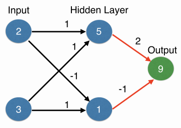
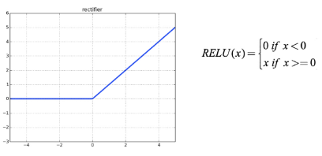
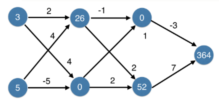
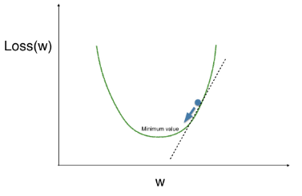
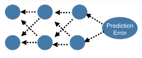
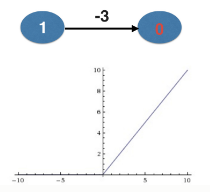
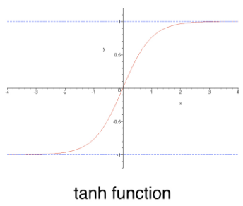
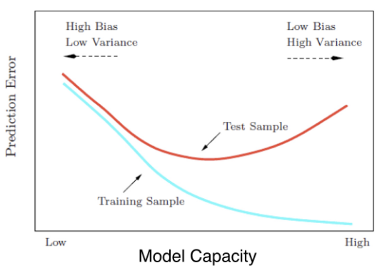

# Deep Learning in Python

# Introduction

## Forward propagation

## Activation Functions

* An activation function allows the nodes to capture non-linearities and capture patterns.
* It is applied to a value coming into the node. It converts the node's input into some output.
* Example: Rectified Linear Activation activation function (ReLU). This function takes a single number as an input, returning 0 if the input is negative, and the input if the input is positive.

relu(3) = 3
relu(-3) = 0

Identity Function: Returns the same output as the input.

## Deeper Networks

* Deep Networks consist of more than 1 hidden layers. The same forward propagation process is used across all the hidden layers.
* Deep networks internally build representations of patterns in the data.
* They partially replace the need for feature engineering since subsequent layers build better representations of the raw data.
* For example, the first hidden layer may identify a line, the second may identify a diagonal, the third may identify a square, and subsequent layers may come up with more complex geometrical shapes based on the data.
* An advantage is that the modeler need not specify these interactions.

# Optimizing Neural Networks

* The output of a neural network depends on the weights assigned at each input at each layer.
* A change in weights may change the outputs to make more accurate predictions.
* Making accurate predictions gets more difficult with more data points.
* At any set of weights there may be many values of the error corresponding to the data points the predictions are made for.

## Loss Function

* A function that aggregates the errors in predictions from many data points into a single number. It gives a measure of the model's predictive performance.
* Low value of the loss function indicates a better model performance.
* Example: Mean Squared Error - squares all the errors and calculates the mean.

**Goal of Optimization:** Find weights such that we get the lowest value of the loss function, i.e. the error is minimised.

## Gradient Descent

* A popular optimization algorithm is the Gradient Descent.
* Following are the steps of this algorithm:
1. Start at a random point.
2. Calculate the slope at this point.
3. Move in a direction opposite the slope.
4. Repeat until the slope is somewhat flat.

* This algorithm eventually leads to the minimum value. Hence, it is used to minimise the value of the loss function.

### Learning Rate

* If the slope is positive: going opposite to the slope means, moving to lower numbers, i.e. Subtracting the slope from the current value.
* In this, the problem is that, if the step is too big, we may move far astray (overshooting minima).
* Hence, we multiply the slope by a small value called learning rate.
* Update the current value by subtracting (learning rate x slope) from the current value.

### Slope Calculation

Consider an example:

        2
    3------->6

Here the input 3, feeds into the output with a weight of 2.
Let, Actual Target=10
Here, the prediction is 6.
Error = 6-10 = -4

To calculate the slope for a weight, we multiply:

* **Slope of the loss function w.r.t the value of the node we feed into.**

In this case, this is the output node 6.
We can observe that, 
2(Predicted-Actual) = 2(Error)  => 2*(-4)

* **The value of the node that feeds into our weight.**
Here, this node is the node 3.

* **Slope of the activation function w.r.t the value we feed into.**
Here, there no activation function and hence can be ignored.

Hence, the slope is given as:

    Slope=2 * (-4) * 3= -24

Now, since we have the slope, we can calculate the new weight.
Consider the learning rate=0.01

    New Weight = Old Value - (learning_rate * Slope)

New weight = 2 - (0.01 * -24) = 2.24

This process is repeated for each weight.
In the end, all the weights are updated *simultaneously*.

## Backpropagation

* This technique propagates the error from the output through the hidden layers to the input layer.
* It allows gradient descent to update all weights in a neural network.

**Process:**
* Estimate the slope of the loss function w.r.t each weight.
* Use forward propagation to calculate the predictions and errors before doing back propagation.
* Go back one layer at a time.
* Calculate the gradient as the product of the three terms described in the above section.
* Need to keep track of the slopes w.r.t the values of the nodes.
* Slope of node values = sum of the slopes of the weights coming out from the node.

## Stochastic Gradient Descent

* Calculates slopes only on a subset of data.
* Use a different batch of data to calculate the next update.
* Start over from the beginning once all the data is used.
* Each time through the training data is called an **Epoch**.

# Deep Learning Models with Keras

The keras workflow has 4 steps:
1. Specify the architecture - number of layers, number of nodes in each layer, activation function
2. Compile the model
3. Fit the model on the training data
4. Use the model to make predictions

## Model specification

After you read the data into an np array, specify the number of columns (data.shape[1]).
This gives the number of nodes in the input layer.

You can specify the type of model to be used:

    model = Sequential()

You can add layers to the network using the add() method.

    model.add(Dense(100, activation='relu', input_shape=(n_cols, )))
    model.add(Dense(100, activation='relu'))
    model.add(Dense(1))

Here, Dense means that every node in the previous layer is connected to every node in the next layer.

100 is the number of nodes in the layer.
'activation' specifies the activation function to be used.
The first line specifies the input layer. The next line specifies a hidden layer.
The last line specifies the output layer with a single node.

## Compiling the model

The compile method in Keras has two different arguments:

1. The optimizer to be used
* This controls the learning rate. 
* The most commonly used optimizer is the **"Adam"**. It adjusts the weights as gradient descent is performed.

2. Loss Function
* The most commonly used function is the mean_squared_error

        model.compile(optimizer='adam', loss='mean_squared_error')

## Fitting the model

* The fit step applies backpropagation and gradient descent with your data to update the weights.
* Scaling the data before fitting can ease the optimization process.

        model.fit(predictors, target)

## Classification models

For classification models,

* The most commonly used loss function used is **categorical_crossentropy**. This is similar to a log loss function. A lower value indicates a better model.
* metrics=['accuracy'] is used in the compile step for easy-to-understand diagnostics.
* The output layer has a different node for each possible outcome and uses 'softmax' activation. This ensures that the predictions are interpreted as probabilities.

## Saving and reloading models using Keras

* When you build a model, you need to save the model. Models are saved in a file having format HDF - Hierarchical Data Format.
* This model can then be reloaded for use.
* Using the reloaded model, you can make predictions.

        from keras.models import load_model
        model.save('my_model.h5')
        mymodel = load_model('my_model.hf)
        pred = mymodel.predict(data)

This can be useful in avoiding rebuilding a model or verifying the structure of the model before making predictions.

# Fine Tuning Keras Models

## Why is Optimization hard?

* The optimal value for any weight depends on the values of the other weights.
* It involves optimizing 1000s of parameters simulataneously with complex relationships.
* Updates may not improve the model meaningfully.
* Updates may be too small if the learning rate used is too small and they may be too large if the learning rate is too large. A smart optimizer like 'Adams' helps but these problems may still persist. 

## Using different Optimizers

You can tune the learning rate in the optimizer being used.
For example, if you are using Stochastic Gradient Descent,

    lr=0.01
    my_optimizer = SGD(lr=lr)
    model.compile(optimizer=my_optimizer, loss='categorical_crossentropy')

## Problems in Optimization

### Dying Neuron Problem

* This problem occurs when a neuron outputs a value of 0 for all the rows in the data. 
* In case of a relu activation function, this would mean, the weight coming into that node is negative.
* Hence, the slop of the weights as well as the output is 0. This means, the weights do not get updated.
* Such a neuron has nothing to add to the model and is hence called *dead*.

At first, we may feel that an activation function which never outputs an exact zero could be a solution.
However, this may result in another problem called Vanishing gradients.

### Vanishing Gradients

Earlier, a popular activation function was used called the *tanh* function.

* This problem occurs when many layers have very small slopes due to being on the flat part of the tanh curve.
* Small slopes may work in networks with very few layers, however, with deep networks, the slopes become close to 0. This implies that in backpropagation, the updates are close to 0.
* Vanishing gradients make it difficult to know which direction the parameters should move to improve the cost function

For the vanishing gradient problem, the first thought would be to use an activation function that does not go flat anywhere. Lot of reasearch has been to evaluate the effects of each of these problems and their solutions.

## Model Validation

* Validation data is the data that is held out explicitly from the training data and is used only to test the model performance. A common technique is k-fold cross validation. In practice, k-fold cross validation on deep learning is very computationally expensive.
* Keras makes it easy to use some data as validation data by specifying a parameter in the fit() method.

        model.fit(predictors, target, validation_split=0.3)

The above statement specifies that 30% of the data should be used as validation data.

* The idea is to have a best possible validation of the model. Hence, we keep training as long as the model is improving. We stop once the validation no longer gives better results. This can be achieved with the help of **Early Stopping**.

        from keras.callbacks import EarlyStopping
        early_stopping_monitor=EarlyStopping(patience=2)
        model.fit(predictors, target, validation_split=0.3, nb_epoch=20, callbacks=[early_stopping_monitor])

The parameter *patience* specifies how many epochs the model can go without training before we stop training any further.

By default, keras trains for 10 epochs. Since we have specified when to stop, we can have a higher number of epochs which is given by nb_epoch=20.

## Model Capacity

* We can experiment with different models to see which one yields bettwe results.
* This experimentation can be based on number of layers, type of model, validation, activation function, etc.
* For this, being aware of the model capacity is important. This term is closely related to Overfitting and Underfitting.
* Model capacity is a model's ability to capture predictive patterns in the data.
* Capacity can be in terms of layers, number of nodes in the layers, etc.

### Workflow for optimizing model capacity

* Start with a simple network and get the validation score.
* Gradually add capacity.
* Keep increasing capacity till the validation score is no longer improving.

Example:

# Links

* https://towardsdatascience.com/adam-latest-trends-in-deep-learning-optimization-6be9a291375c
* https://keras.io/optimizers/#adam